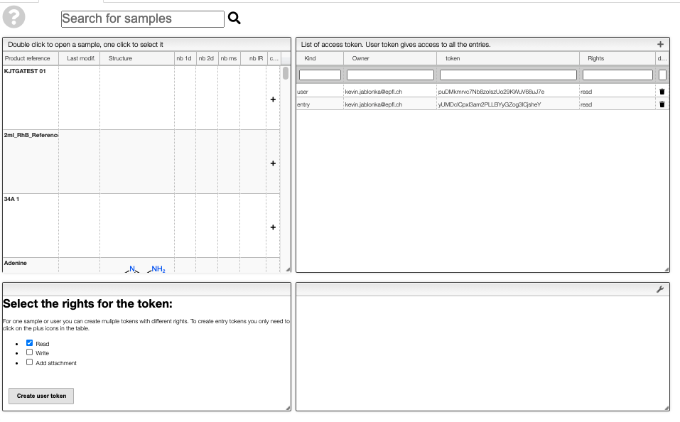

Getting started
=======================

Installation
---------------

We recommend installing cheminfopy in a dedicated `virtual environment <https://docs.python.org/3/tutorial/venv.html>`_ or `conda environment <https://docs.conda.io/projects/conda/en/latest/user-guide/tasks/manage-environments.html>`_. Note that we currently support Python 3.7 and 3.8.

To install the latest stable release use

.. code-block:: bash

    pip install cheminfopy

The latest version of cheminfopy can be installed from GitHub using

.. code-block:: bash

    pip install git+https://github.com/cheminfo-py/cheminfopy.git

High-level overview
---------------------
The idea behind this library is to provide an easy way to interact with the cheminfo ELN. For example, from Jupyter notebook.

Use cases can be:

- Get some samples for further analysis that is currently not implemented in the ELN
- Get many samples for some machine learning project
- Programmatically add spectra or data to some entries in the ELN

To do so, this library is organized around managers that provide ways to interact with the different "kinds" of objects that are
stored in the ELN:

- :py:class:`~cheminfopy.managers.sample.Sample` can be used to retrieve information about a sample and add new data to one sample
- :py:class:`~cheminfopy.managers.user.User` can be used to retrieve information on the user level, e.g., to list all samples that are user has access to
- :py:class:`~cheminfopy.managers.experiment.Experiment` can be used to interact with the reaction entries in the ELN

Basic interactions with a sample
---------------------------------

Initialization of :py:class:`~cheminfopy.managers.sample.Sample`
...........................................................................

Before you can perform any query, you need to initialize a :py:class:`~cheminfopy.managers.sample.Sample`.

.. code-block:: python

    from cheminfopy import Sample

    # you need to initialize the sample manager with the ELN instance, the UUID of a sample and a token
    my_sample_manager = Sample(instance='https://mydb.cheminfo.org/', sample_uuid='ca5915318397af313e55b3181f7b3a1c', token='TJyOgqRYyDusBmbGytvbNhTvgC3q5mfdg')

There are a view pieces of information that you need to get from the ELN for that:

- The token: You can get tokens from the ELN in a view that looks somewhat like the following (on `c6h6.org <c6h6.org>`_ in the "Tools" tab)

- The sample UUID: This is the unique identifier of the sample. We will put it into the links and that the token view shows you and you can also find it in the sample table

- The instance will show under the heading "Your database instance"

But, the view in the ELN will also show you input that you can just copy-paste to initalize the :py:class:`~cheminfopy.managers.sample.Sample`. For entry tokens, it will also automatically fill the `UUID`.

Retrieving information
............................

Many core properties of a sample are accessible as properties of the :py:class:`~cheminfopy.managers.sample.Sample`.
That is to get the molecular formula you have to do nothing else than :py:attr:`my_sample_manager.mf`.

One common use case might be that you want to retrieve some file. For this, we have the :py:meth:`~cheminfopy.managers.sample.Sample.get_data` method, which expects you to put the type of spectrum (e.g., "ir", "isotherm", ...) and the filename.

.. code-block:: python

    my_sample_manager.get_data('isotherm', 'BET.jdx')

Which will return you the content of to the JCAMP-DX file. To convert JCAMP-DX files to Python dictionaries, you can use the `jcamp library <https://github.com/nzhagen/jcamp>`_.

The question might be know: What do I do if I have no clue what the filename is? Then you can get a list of all available spectra using the :py:attr:`my_sample_manager.spectra` property of the `Sample` object.

Adding information
..........................

If you performed some analysis (e.g., you computational colleagues perfomed a structure optimization) you might want to add some data back to the ELN.
For this, you can use the :py:meth:`cheminfopy.managers.sample.Sample.put_data` method. Please keep in mind our `data schema <https://cheminfo.github.io/data_schema/>`_ when you use this method. For instance, you can only use the types that are implemented in the schema and we recommend that you only upload JCAMP-DX files for spectral data.
To convert Python dictionaries into JCAMP-DX files you can use the `pytojcamp library <https://github.com/cheminfo-py/pytojcamp>`_.

.. code-block:: python

    source_info = {
        "uuid": "34567896rt54ery546788969870890",
        "url": "https://aiidalab-demo.materialscloud.org/hub/login",
        "name": "Isotherm simulated using the isotherm app on AiiDAlab"
    }
    metadata = {
        "gas": "N2",
        "temperature": 200
    }
    my_sample_manager.put_data(data_type='isotherm', name='BET.jdx', filecontent='<your_file_content>', metadata=metadata, source_info=source_info)

Note that we also provided :code:`source_info` as dictionary. This is information that we will save in the database such that you can trace back, at some future point in time, where the information came from. In this case, this new attachment came from a simulation in `AiiDAlab <https://www.materialscloud.org/work/aiidalab>`_. Hence we can use this description for the source name and use the :code:`uuid` to point to the node of the same object in the `AiiDA <https://www.aiida.net/events/>`_ database.

Global access to the ELN
---------------------------

If you have a user token, you can use the :py:obj:`~cheminfopy.managers.user.User` class. With the :py:func:`~cheminfopy.managers.user.User.get_sample` method you can get a :py:obj:`~cheminfopy.managers.sample.Sample` object given a :code:`UUID` of a sample.

Basic interactions with a reaction
-----------------------------------

Initialization of :py:class:`~cheminfopy.managers.experiment.Experiment`
...........................................................................

Before you can perform any query, you need to initialize a :py:class:`~cheminfopy.managers.experiment.Experiment`.

.. code-block:: python

    from cheminfopy import Experiment

    # you need to initialize the experiment manager with the ELN instance, the UUID of an experiment and a token
    my_experiment_manager = Experiment(instance='https://mydb.cheminfo.org', experiment_uuid='ca5915318397af313e55b3181f7b3a1c', token='TJyOgqRYyDusBmbGytvbNhTvgC3q5mfdg')

You can then access the main properties of the reaction using properties, e.g. :py:attr:`my_experiment_manager.reactionRXN`.

What reactions and samples do I have access to?
-----------------------------------------------

To get a "table of contents" overview of the samples and reactions that you have access to, you can use the :py:func:`~cheminfopy.managers.user.User.get_sample_toc` and :py:func:`~cheminfopy.managers.user.User.get_experiment_toc` methods.
